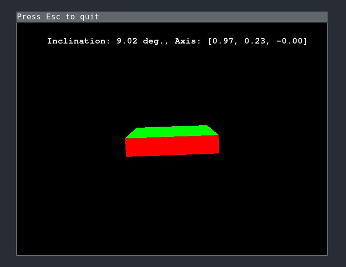

# Visualize UAV On-board sensor data with Python



<!-- markdown-toc start - Don't edit this section. Run M-x markdown-toc-refresh-toc -->
**Table of Contents**

- [Purpose](#purpose)
- [Introduction](#introduction)
- [Instructions](#instructions)
    - [Requirements](#requirements)
        - [Client (laptop computer)](#client-side-laptop-computer)
        - [Server (mobile phone)](#server-side-mobile-phone)
- [References](#references)

<!-- markdown-toc end -->


## Purpose
Stream and visualize UAV sensor data in Python. As an example
algorithm, a Quaternion-free inclination tracking Kalman filter.

## Introduction

This project contains an example implementation of a development environment consisting of

- Data receiving from UAV to (e.g. laptop) computer,
- Sensor fusion algorithm for estimating sensor orientation,
- Real-time visualization on display.

The inclination (gravitation) tracking in based on a quaternion-free Kalman
filtering method for estimating gravitation direction in sensor's coordinates.
Visualization using OpenGL and Pygame.

## Instructions

### Requirements

#### Client (laptop computer)

Python programming environment can be installed with

``` shell
pip install -r requirements.txt
```

**NOTE:** PyOpenGL requires typically an OpenGL utility toolkit, e.g.
`freeglut3-dev` on Ubuntu Linux.

#### Server


1. Install the **SensorStreamer** app
2. Configure a data package with gyroscope and accelerometer data
3. Configure a connection with your favorite port (e.g. 3400)
4. Find out our mobile phone IP address (Search "IP Address" in Android)
   - An option is to activate a "Mobile hotspot" local network and connect
     the laptop to the network
5. Start a stream in the app with `Lowest possible period`
6. Launch visualization program:

``` shell
python sensorstream.py --host=<insert_your_phone_ip_address> \
                       --port=3400 \
                       --buffer=8192 \
                       --method=naive
```
   
## References

S. Särkkä et. al, [_Adaptive Kalman filtering and smoothing for gravitation tracking in mobile systems_](https://ieeexplore.ieee.org/abstract/document/7346762)

